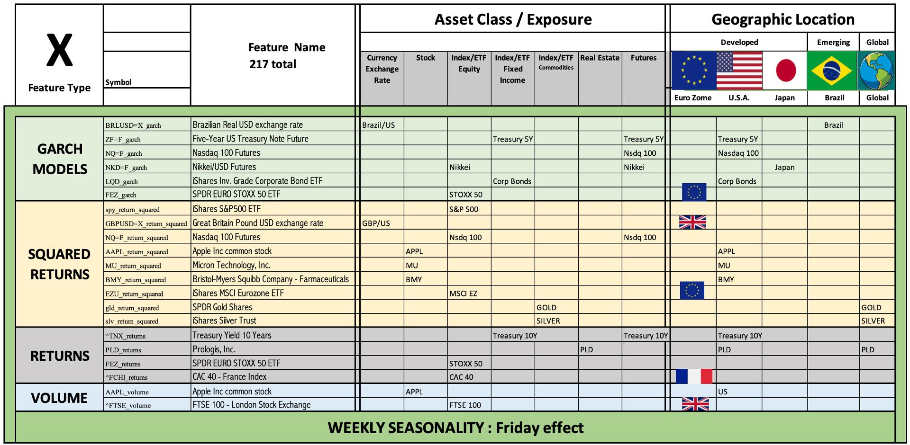

# VIXM Algorithmic Trading Strategy
An algorithmic trading strategy incursion to create the first volatility security suitable for long term investors.

<div id="top"></div>


<!-- TABLE OF CONTENTS -->
<details>
  <summary>Table of Contents</summary>
  <ol>
    <li> <a href="#about-the-project">About The Project</a>
      <ul>
        <li><a href="#built-with">Built With</a></li>
      </ul>
    </li>
    <li> <a href="#getting-started">Getting Started</a>
      <ul>
        <li><a href="#installation">Installation</a></li>
      </ul>
    </li>
    <li><a href="#usage">Usage</a></li>
    <li><a href="#model-specifications">Model Specifications</a></li>
      <ul>
        <li><a href="#prior-project">Prior Project: the VIX Predictor</a></li>
      </ul>
      <ul>
        <li><a href="#adaboost-model-for-VIXM-trading-strategy">Adaboost model for VIXM trading strategy</a></li>
      </ul>
    <li><a href="#license">License</a></li>
    <li><a href="#contact">Contact</a></li>
    <li><a href="#acknowledgments">Acknowledgments</a></li>
  </ol>
</details>

<!-- ABOUT THE PROJECT -->
## About The Project
In crushes, when all assets plunged altogether, the [VIX Index](https://www.investopedia.com/terms/v/vix.asp) goes up. An investment in the VIX would be ideal to diversify risk on those scary moments. However, the VIX is not investable, and nowadays all instruments available to invest in volatility are done through VIX futures. These instrument are called ETN (ie. VXX, VIXM, UVXY), and are only suitable for high risk professional investors, because they undergo a price decay effect due to the rollover of the future contracts. This means, if you invest in the VIXM ETN and keep the investment for some weeks, it is highly probable that you are going to loose money.

This project generates an algorithmic daily-trading strategy on the VIXM to compensate for price decay. Using an [Adaboost machine learning classification model](https://scikit-learn.org/stable/modules/generated/sklearn.ensemble.AdaBoostClassifier.html), the algorithm classifies the next day as a "positive return day" (signal 1) or a negative return day (signal 0), allowing an oportunity to filtering out some of the days with negative returns on a consistent basis.

This project aims to generate a model with enough accuracy so to enable a volatility investment vehicle without price decay. We want allow regular long term investors to invest in volatility. The day that this instrument exist, it will be an extraordinary asset to diversify risk in portfolios.

This research started with the prediction of the VIX in [VIX Predictor project](https://github.com/paocarvajal1912/vix_predictor), and was followed by a second project called ["VIXCOIN"](https://github.com/Fintech-Collaboration/vixx-token-dapp). The model presented here is the machine learning algorithm part of the latter project. VIXCOIN is a token which performance is associated to the performance of the VIXM algorithmic trading strategy explained here, and it will be sold in the blockchain. 

DISCLAIMER: Investment in our product is not an option yet. 

<p align="right">(<a href="#top">back to top</a>)</p>

### Built With
The adaboost machine learning algorith was built utilizing at least python 3.7 for the back end data analysis and machine learning 

Python Packages
* [Pandas](https://pandas.pydata.org/)
* [Numpy](https://numpy.org/)
* [Datetime](https://pypi.org/project/DateTime/)
* [yfinance](https://pypi.org/project/yfinance/)
* [Sci-kit learn](https://scikit-learn.org/stable/)
* [Hvplot](https://hvplot.holoviz.org/)
* [Matplotlib](https://matplotlib.org/)
* [sys](https://docs.python.org/3/library/sys.html)

<p align="right">(<a href="#top">back to top</a>)</p>

<!-- GETTING STARTED -->
## Getting Started
To get a local copy up and running follow these steps below. 
Alternatively, you can jump straight to the demo section and test out the wesbite portion. 

### Installation
1. Clone the repo
   ```sh
   git clone https://github.com/paocarvajal1912/VIXM-Algorithmic-Strategy.git
   ```
2. Install python packages listed in the Built With section. 
3. To test out the algorithmic trading strategy file, first go to your terminal. 
4. In your terminal, navigate to the location where the cloned repo resides.
5. Locate `vixm_adaboost_model.ipynb` and launch the file in jupyter notebook for data visualizations. 
6. Alternatively, if you would like to rerun the model, you may import the file into Google Colab. 
7. Website functions are covered in the Demo portion. 

<!-- USAGE-->
## Usage

The main file `vixm_adaboost_model.ipynb` is a Jupyter Notebook with a pre-run code. You can go through it and see code as well as results. 

If you look to reuse the code, and do not have experience on jupyter lab, you can refer [this tutorial.](https://www.dataquest.io/blog/jupyter-notebook-tutorial)

<p align="right">(<a href="#top">back to top</a>)</p>


<!-- Model Specifications -->
## Model Specifications

#### Prior project

Our first attempt was to predict the VIX Index in the [VIX Predictor project](https://github.com/paocarvajal1912/vix_predictor). In that project, we tried a Neural Network model, and then an Adaboost model. The adaboost brought better results, with a 58% accuracy out of sample. We got 22 out of 217 features that contributed to the model. These were varied from Garch model conditional volatility predictions, squared returns, returns, and volume belonging to all sort of asset classes and global locations, as can be seen in the table below. In addition, weekly seasonality was also important.


<p align="right">(<a href="#top">back to top</a>)</p>

However, the VIX Index is not investable. After we were able to see that it is possible to have capacity of prediction, we wanted to try a security that invest in the VIX. We selected ther VIXM because of having the larger history available. The next sub-section explains the model on VIXM in more detail.

#### Adaboost model for VIXM trading strategy
This code is a marchine learning model to predict the sign of the return of the VIXM ETN for the next trading day.

A series of tickers are defined in a list, and time series of daily prices and volumes are downloaded using the Yahoo Finance API for each of those tickers. With the prices, we generate additional time series and seasonal analysis. Additionally, to include historical effects of more than one day on the prediction of the VIXM return sign tomorrow, we calculate principal components of the initial features, and add one week of daily lagged values in the features as well. 

The final list of features is as follows:
 * Close prices
 * Returns
 * Volumes
 * Garch Models - The value of the conditional volatility predicted for the next day
 * Return squared
 * SPY historical volatility for several periods
 * Day-of-the-week seasonality
 * Month-of-the-year seasonality
 * A custom number of principal components lagged on 1, 2, 3, 4 and 5 days representing historical movements
 
Several functions have been defined in two files:
 > `vixcoin_functions/feature_functions.py` and  
 > `vixcoin_functions/pca_and_training.py`
 
The model applied is the `Adaboost` Model. The investment strategy consist in an algorithmic trading that follows the signals from the model, which are  0 and 1 daily. The strategy buys VIXM when the signal is 1, and sell VIXM when the signal comes back to 0.

The code includes analysis of.
    
    * profitability of the strategy
    * accuracy
    * feature importance and 
    * adaboost tuning tools


<p align="right">(<a href="#top">back to top</a>)</p>

<!-- LICENSE -->
## License
<div align="left">
Distributed under the MIT License.
https://github.com/git/git-scm.com/blob/main/MIT-LICENSE.txt)

<p align="right">(<a href="#top">back to top</a>)</p>

<!-- CONTACT -->
## Contact
<div align="left">

Paola A. Carvajal Almeida - paola.antonieta@gmail.com

[Here is my LinkedIn profile](https://www.linkedin.com/in/paolacarvajal/)
    
[Here is my portfolio in GitHub](https://github.com/paocarvajal1912)


<p align="right">(<a href="#top">back to top</a>)</p>


<!-- ACKNOWLEDGMENTS -->
## Acknowledgments
    
Thanks to the other teams members that worked in both projects. Some parts of those README files have been taken in this one:
    
**VIX Predictor:**
* Sangram Singh - [@Github](https://github.com/sangramsinghg)
* Ahmed Mohamed - [@Github](https://github.com/Ahmed-Mahjoub)
* Doreen Ngo - [@Github](https://github.com/ngomatterwhat)
    
**VIXCOIN**
    
* [Jason Garcia](https://www.linkedin.com/in/24-jason-j-garcia/) [@Github](https://github.com/jasonjgarcia24)
* [Prateek Sharma](https://www.linkedin.com/in/prateek-sharma-21a081180/) [@Github](https://github.com/puru444)
* [Srini Goda](https://www.linkedin.com/in/srini-goda-2305644/) [@Github](https://github.com/your_username/repo_name)
* [Jasmine Tengsico](https://www.linkedin.com/in/jasmine-tengsico-5030b0167/) [@Github](https://github.com/jtengsico)
    
**Credit to creator of readme template.**
* [README Template](https://github.com/othneildrew/Best-README-Template.git)

<p align="right">(<a href="#top">back to top</a>)</p>

